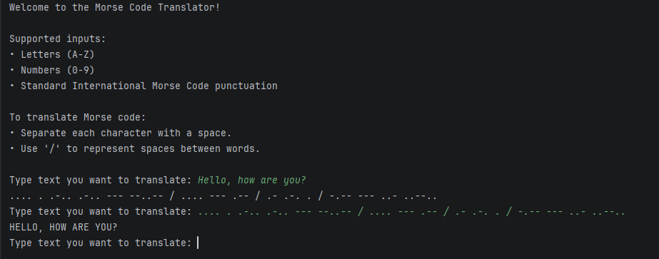

# Morse Code Translator

A command-line application written in Python that translates plain text to Morse code and vice versa.

## How to Run

Clone the repository and run:

```bash
python main.py
```

## Features

- Translate text to Morse code
- Translate Morse code to text
- Automatic translation direction detection
- Supports International Morse Code
- Input validation

## Screenshot



## Technologies

- Python 3
- Dictionaries
- Dictionary Comprehension
- String Manipulation
